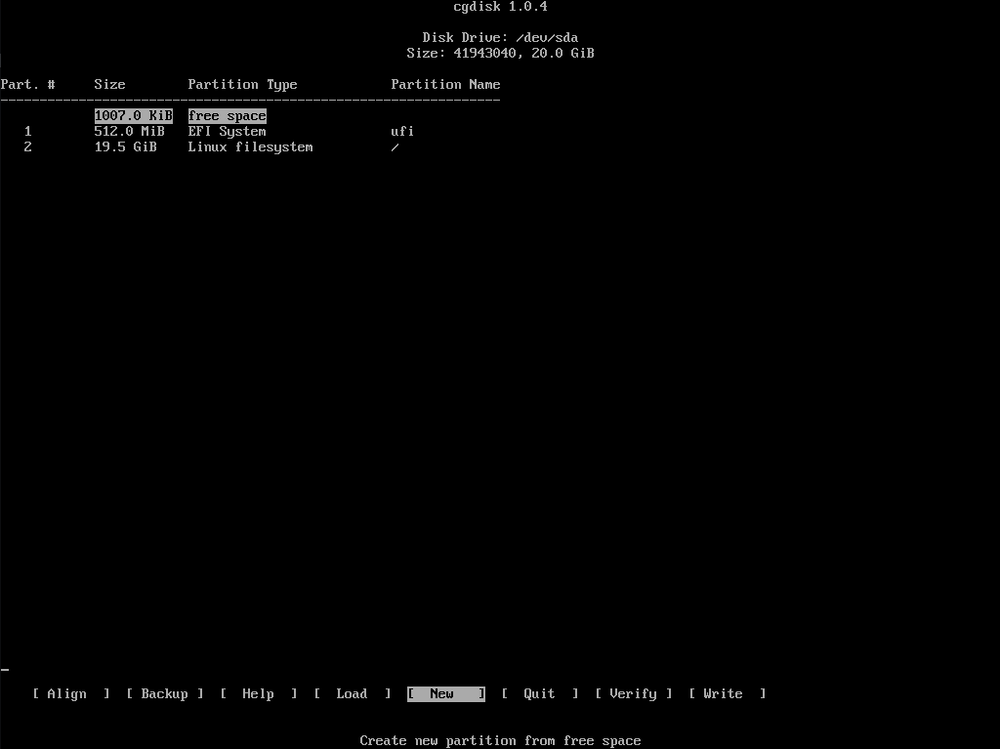

# From empty disk to bootable (Arch Linux install tips 2019-11-30)

### Add new disk postition
    $ lsblk  #check disk
    $ cgdisk /dev/sdx   #add disk postition tool

### Format disk postition
    $ mkfs.vfat /dev/sdx  #for uefi
    $ mkfs.ext4 /dev/sdx  #for /, home ...
    $ mkfswap /dev/sdx  #swap

### Mount postition
    $ mount /dev/sdxy /mnt  #/
    $ mkdir /mnt/home
    $ mount /dev/sdxy /mnt/home  #home
    $ mount /dev/sdxy /mnt/boot  #efi option
    $ swapon /dev/sdxy  #swap

### Set mirrolist
    edit /etc/pacman.d/mirrorlist

### Download Arch Linux file
    $ pacstrap /mnt base

### Into new system
    $ arch-chroot /mnt

### Create boot img
    $ pacman -S linux linux-firmware mkinitcpio
    $ mkinitcpio -p linux

### Set GRUB (and uefi)
    $ pacman -S grub efibootmgr
    $ mkdir /boot
    $ mount /dev/sdxy /boot
    $ grub-install --target=x86_64-efi --efi-directory=/boot --bootloader-id=arch_grub --recheck --debug
    $ mkdir -p /boot/grub/locale
    $ cp /usr/share/locale/en\@quot/LC_MESSAGES/grub.mo /boot/grub/locale/en.mo
    $ grub-mkconfig -o /boot/grub/grub.cfg

### Useful tools
    1. networkmanager  #need stop & disable systemd-networkd
    2. bash-completion

### Write fstab to new system fstab
    $ exit  #leavn chroot
    $ genfstab -p -U /mnt > /mnt/etc/fstab

### Reboot
    $ reboot  #reboot system

---

Click here back to [home](./README.md) page.
